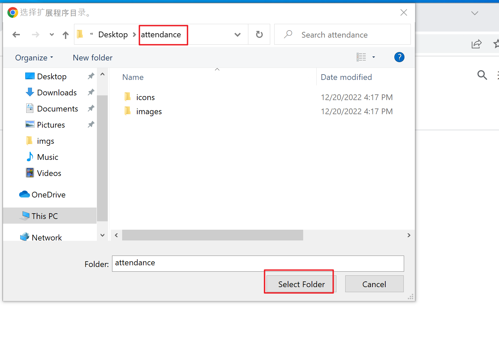

# 美团考勤记录插件

## 背景
- 转眼间时间到了2022年底，从我走出校门参加工作起已经快三年的时间，是时候来用心做一个属于自己的应用，让它能充实我的业余时间、保持我对技术追逐的热情。
- 由于大环境的变化，今年各部门高层非常关注各个部门的平均工时，但是目前考勤系统，因为一些神秘的原因，没有了历史打卡记录，原工时统计插件也无法统计到个人的平均工时，为了解决该痛点，开发了本插件，通过定时任务和手工编辑方式记录个人工时，卷工时就从这里开始吧。

## 功能
- 每天定时同步当天打卡信息并保留在本地存储，历史工时数据降从本地获取，解决HR系统不能查看历史工时的痛点
- 支持手工编辑历史打卡信息，避免下班关机后，记录最后一次打卡信息失败的问题
- 工时统计信息在原有基础上进行改造，为了隐私，去除掉个人信息

## 安装
- **第一步** 如果安装原美团考勤插件，请卸载掉，避免页面冲突，如果未安装，可忽略
- **第二步** 到[release页面](https://github.com/kaishuituan/meituan-kaoqin/releases)下载最新版本的`attendance.zip`文件到本地并解压到文件夹，**本地文件夹最好是不容易误删的地方，误删容易导致插件不可用**

- **第三步** 打开Chrome插件设置

- **第四步** 点击页面右上角的开发者模式按钮，打开开发者模式，然后点击"加载已经解压扩展程序"

- **第五步** 选择前面下载并解压后的插件文件夹

- **第六步** 点击Chrome工具栏插件设置，将插件展示在工具栏，方便后续快速使用

## 说明
- 本插件只记录个人打卡信息，由于统计不是实时和服务器通信，数据仅供参考，不具有官方性和法律性
- **由于chrome官方市场能查询到个人信息，为了避免不必要的麻烦，本插件发布到该仓库，仅供离线安装使用**

## 版本
- 2022.12.20 第一个版本完成
